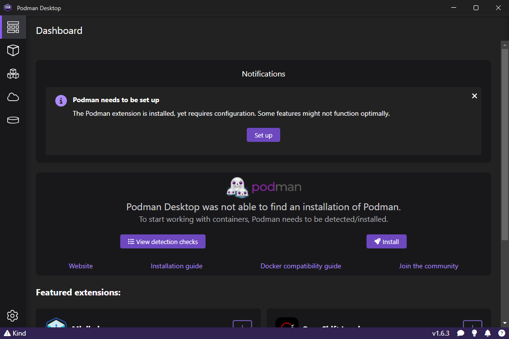
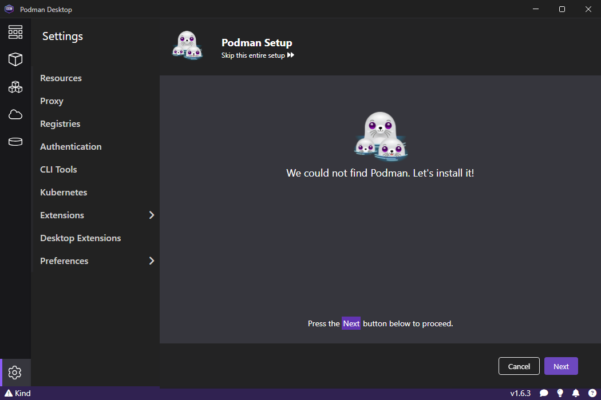
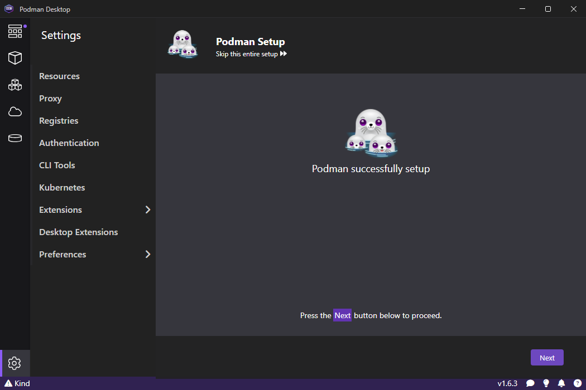
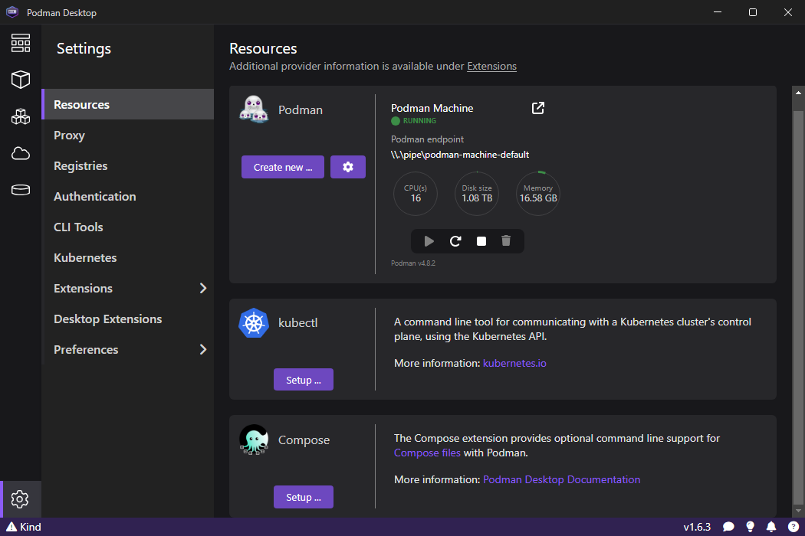
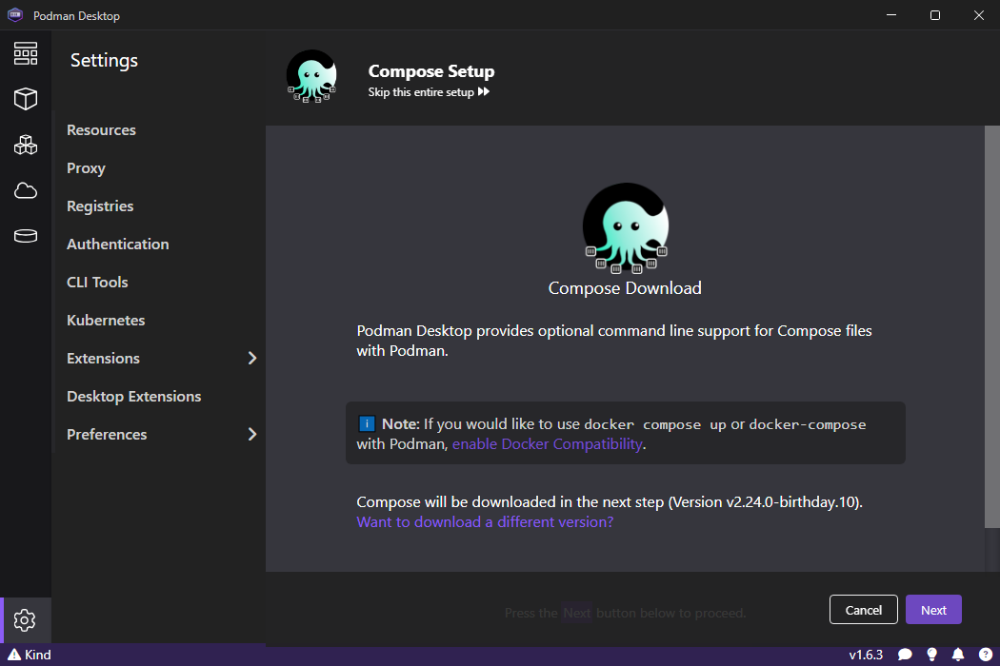

# Prerequisites:

Windows Subsystem for Linux 2 (WSL2) must be installed on your Windows machine.  Installation instructions [here]("https://learn.microsoft.com/en-us/windows/wsl/install"). Also, git should be installed via an IDE or standalone.

# Installation instructions:

1. Install Python from [here]("https://www.python.org").
2. Install Podman Desktop using the instructions [here]("https://podman-desktop.io/docs/installation/windows-install").
3. Configure the Podman setup:
    
   1. Open Podman Desktop: 
   
   2. Click on "Set up": 
   
   3. Click "Next" until complete: 

4. Install Podman Compose:

    1. Click on the Settings gear -> Resources: 
   
    2. On the Compose tile, click "Setup": 
    
    3. Click "Next" until complete.

## Troubleshooting:

Using a VPN can cause WSL2 VMs to not be able to retrieve dependencies from the internet. This can normally be resolve by installing user-mode networking on Podman. To do so:

1. Open a Powershell or command prompt.
2. Enter "podman machine stop" and wait for completion.
3. Enter "podman machine rm" and answer "y" to all prompts.
4. Enter "podman machine init --user-mode-networking" and wait for completion.
5. Enter "podman machine start" and wait for completion.

