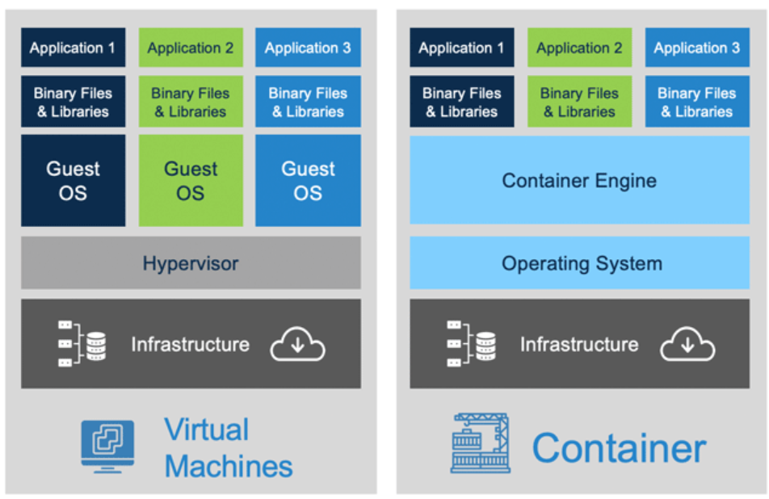

# Containerization Basics

These workshop materials are for getting a solid foundation for what containers are, and how they're typically used.

## To get started:

- Clone this repository locally.
- Follow the installation instructions [here](Installation.md)
  
## Why containers?

- Local development environments made easy.
- Deployment needs:
  - The ability to deploy only the bare minimum application components.
  - Simple, automated rollouts/rollbacks.
  - To not have to worry about prequisites installed on physical machines.
- We want to run multiple applications the same hardware without the overhead of VMs, but still isolated from each other.

## If not a VM, what's the difference?

- VM's virtualize multiple unique OS environments:
  - This allows Linux and Windows to run on the same hardware.
  - A hypervisor controls the virtualization of the OS, either:
    - Type 1: Bare metal (VMWare vSphere, KVM, Xen).
    - Type 2: OS hosted (VirtualBox, VMWare Workstation).
  - Can utilize hardware assistance to ensure isolation (Intel VT-x, AMD-V).
- Containers are virtualized by the OS, and must target that platform:
  - Windows containers must run on a Windows host.
  - Linux containers must run on a Linux host.
  - Except when they don't (Windows Subsystem for Linux).
  - Similar to a sandboxed application.

## Where's Docker in all of this?

Docker is the most well known company/technology in the world of containers, as they were able to assemble all of the individual components into a user-friendly package.  However, there are open source alternatives:

- [LXC](https://linuxcontainers.org/)
- [Podman](https://podman.io/)
- [runC](https://github.com/opencontainers/runc)

Docker has started charging license fees for Docker Desktop, which is why this workshop utilizes Podman.

## How do containers tick then?

### The 50ft view

The Open Container Initiative ([OCI](https://opencontainers.org/)) formalized three specifications for containerization:

- Runtime (for how images are unpacked and run on machines)
- Image (for how the definition of a container is persisited)
- Distribution (For how images are accessed and deployed)

### The 10ft view

Operating systems already have a mechanism for isolating applications: Processes.

The problem with this is that processes all share:
- The same file system.
- Run as user(s) in the same pool.
- Share the same host name.
- Share the same network and IP address.
- Have the same access to the processor.

Containers are basically a consolidated way to run an application in a process that enhances isolation between others using features supported by the OS.

In a Linux server, for example, the primary methods used are namespaces. Namespaces isolate OS resources by restricting the ability to see or use resources outside of the namespace the application is running in.  There are multiple namespace implementations for resources:

- Mount: Containers can have their own devices mounted.
- PID: Child processes in a container can be assigned independently to those outside the namespace.
- Network: Allows individual virtual adapters, and can have its own IP.
- Cgroup: Sets limits on resource usage, e.g. CPU and RAM.
- UTS: Allows a container to have its own hostname.
- User: Maps users defined in the container to a range outside of the hosts users. This is to prevent root users in a container from escalating privilege to the host.
- Chroot: Gives the container an isolated root file system.

## Demos

- Running a single container.
- Building an image.
- Local composed containers.
- Inspecting the details.
